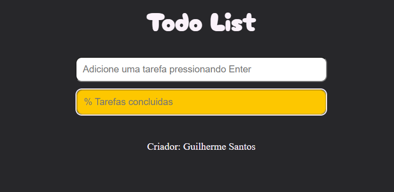
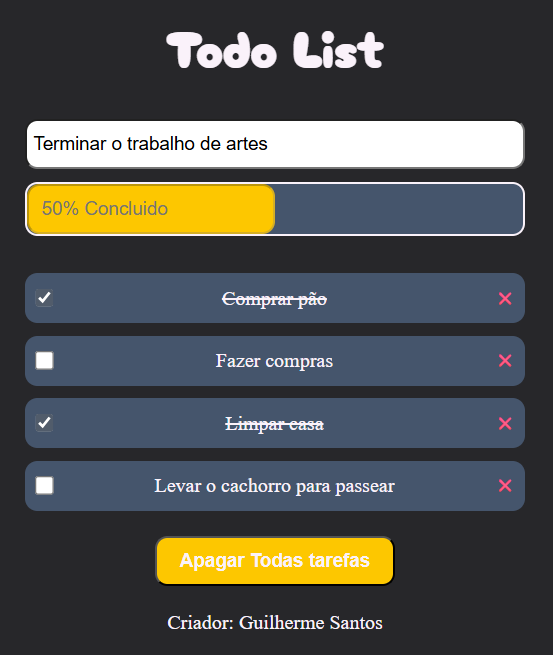
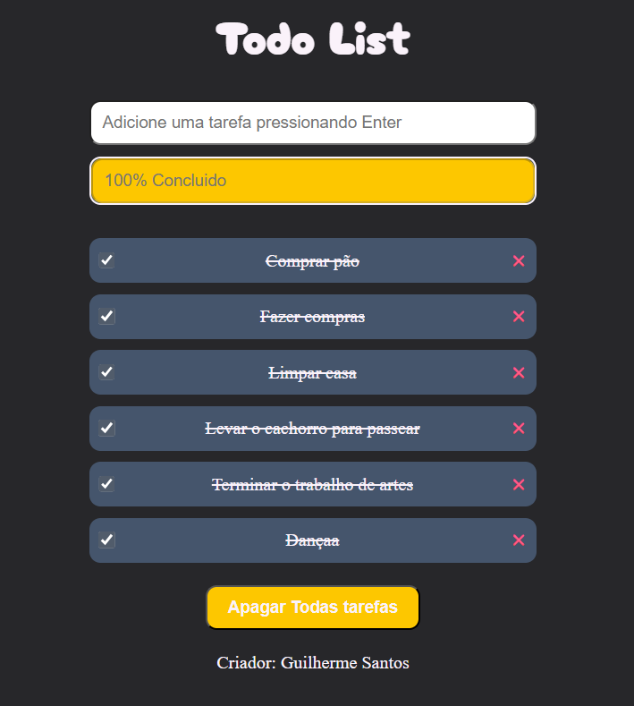

# To-Do List Simples

## ✅ Descrição do Projeto

Este é um aplicativo de **Lista de Tarefas** simples e intuitivo, desenvolvido utilizando **HTML**, **CSS** e, principalmente, **JavaScript puro**. O projeto serviu como um laboratório para aplicar e aprofundar meus conhecimentos em JavaScript, focando na manipulação do DOM e na persistência de dados. Ele permite aos usuários gerenciar suas tarefas diárias de forma eficiente, com a garantia de que os dados permanecerão salvos no navegador.

<a href=" https://guiihsantos.github.io/Todo_List/" target="_blank">🔗 Acesse o projeto online</a>

## Funcionalidades do Projeto

- **Adicionar Tarefas**: Crie novas tarefas de forma rápida.
- **Marcar Tarefas Concluídas**: Altere o status de uma tarefa para "concluída".
- **Remover Tarefas Individuais**: Exclua tarefas específicas da lista.
- **Remover Todas as Tarefas**: Limpe toda a lista de uma vez.
- **Persistência de Dados**: Suas tarefas são salvas no **LocalStorage** do navegador, mantendo-as mesmo após fechar a página.
- **Progresso Visual**: Uma barra de progresso mostra a porcentagem de tarefas concluídas.

## 💻 Testes de Software

Durante o desenvolvimento, foram realizados os seguintes testes:

- **Teste de Funcionamento**:
  - Verificação da criação e exibição correta de novas tarefas.
  - Teste da funcionalidade de marcar e desmarcar tarefas, garantindo que o `status` seja atualizado.
  - Confirmação de que a remoção de tarefas individuais e o apagamento de todas as tarefas funcionam conforme o esperado.
  - Validação da persistência de dados no `LocalStorage` após recarregar a página.
  - Teste da barra de progresso, assegurando que a porcentagem de conclusão seja calculada e exibida corretamente.
- **Teste de Depuração**:
  - Correção de pequenos bugs na interação com o DOM.
  - Ajustes na lógica de atualização da interface para garantir fluidez.
  - Otimização para evitar recriação desnecessária de elementos HTML, melhorando o desempenho.

## 📦 Tecnologias e Linguagens

- **HTML5**: Estrutura e semântica da página.
- **CSS3**: Estilização e responsividade da interface.
- **JavaScript (ES6+)**: Lógica de manipulação do DOM, gerenciamento de estado e interação com `LocalStorage`.

## 🔨 Pré-requisitos e Instalação

Para usar este projeto, você só precisa de um **navegador web moderno**.

Para rodar o projeto localmente:

1.  **Clone o repositório**:
    ```bash
    git clone https://github.com/GuiihSantos/Todo_List.git
    ```
2.  **Navegue até o diretório do projeto**:
    ```bash
    cd Todo_List
    ```
3.  **Abra o arquivo `index.html`**:
    Simplesmente clique duas vezes no arquivo `index.html` ou arraste-o para o seu navegador.

## ✅ Instruções de Uso

1.  **Adicionar uma Tarefa**: Digite sua tarefa no campo de entrada na parte superior e pressione `Enter`.
2.  **Marcar/Desmarcar**: Clique na caixa de seleção (`checkbox`) ao lado de uma tarefa para marcá-la como concluída ou não concluída.
3.  **Remover Tarefa**: Clique no ícone **❌** ao lado da tarefa que deseja remover.
4.  **Limpar Todas as Tarefas**: Clique no botão **"Limpar Todas as Tarefas"** (se visível) para apagar toda a lista.
5.  **Acompanhar Progresso**: A barra na parte superior mostrará a porcentagem de tarefas que você já concluiu.

## 📄 Documentação

- [MDN Web Docs - HTML](https://developer.mozilla.org/pt-BR/docs/Web/HTML)
- [MDN Web Docs - CSS](https://developer.mozilla.org/pt-BR/docs/Web/CSS)
- [MDN Web Docs - JavaScript](https://developer.mozilla.org/pt-BR/docs/Web/JavaScript)
- [MDN Web Docs - Web Storage API (LocalStorage)](https://developer.mozilla.org/pt-BR/docs/Web/API/Web_Storage_API)

## 🪪 Licença

Este projeto está licenciado sob a **Licença MIT**. Você pode usar, modificar e distribuir este código para fins educacionais e não comerciais, desde que a atribuição original seja mantida.

## 📷 Imagens do projeto:

<div style="display: flex; justify-content: center; " >
  <div  align="center">
    
    
    
  </div>
</div>
